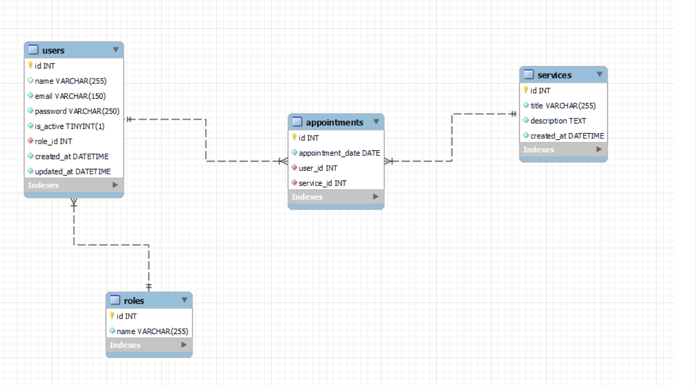

#  Tattoo Studio Backend Project 
 
 


## Table of Contents 📝
- [About the Project 📁](#about-the-project-📁)
- [ER Diagram from SQL 📋](#er-diagram-from-sql-📋)
- [Local Installation Option ⚙️](#local-installation-option-⚙️)
- [Stack](#stack)
- [Endpoints ⚙️](#endpoints-⚙️)
- [Future Functionalities 👨🏻‍💻](#future-functionalities-👨🏻‍💻)
- [Development 🌐](#development-🌐)
-  [Deploy 🚀](#deploy-🚀)
- [Author ✒️](#author-✒️)
- [Thanks 🎓](#thanks-🎓)

## About the Project 📁
This project consists of the management of appointments for a tattoo studio which contains the creation of an application in which users can register, log in and access their personal area. Within your area, you will be able to view a list of scheduled appointments for tattoo and piercing services, as well as create new appointments for various services offered by the studio.


##  Diagram SQL 📋



## Local Installation  ⚙️

1. Clone the repository from the url
2. `$ npm install` (to get all the node packages)
3. Connect the cloned repo with our Database
4. `$ Execute the migrations`
5. `$ Execute the seeders`
6. `$ npm run dev` to run our server
7. ...

## Stack
Tecnologías utilizadas para el proyecto:
<div align="center">
<a href="https://www.expressjs.com/">
    
</a>
<a href="https://typescriptlang.org">
     
</a>    
<a href="https://nodejs.org/es/">
    
</a>
<a href="https://developer.mozilla.org/es/docs/Web/JavaScript">
    
</a>
<a href="">

</a>
<a href="">
    
</a>
<a href="">
    
</a>
<a href="">
    
</a>
 </div>

 ## Endpoints ⚙️

<details>
<summary>Authentication</summary>

- AUTH

  - REGISTER

          POST http://localhost:4000/api/auth/register

    body:

    ```js
        {
            "email": "tatiana@tatiana.com",
            "password": "123456789"
        }
    ```

  - LOGIN

          POST http://localhost:4000/api/auth/login

    body:

    ```js
        {
            "email": "tatiana@tatiana.com",
            "password": "123456789"
        }
    ```

      </details>
      <details>

<summary>Users</summary>

- USERS

      - GET ALL USERS (IsSuperAdmin)

              GET http://localhost:4000/api/users

          auth:
          ```
          your token

          ```

       - SHOW USER PROFILE

              GET http://localhost:4000/api/users/profile

          auth:
          ```
          your token

          ```

      - CHANGE PROFILE INFO

              PUT http://localhost:4000/api/users/profile

          auth:
          ```
          your token

          ```
          body:
          ``` js
              {
                  the information you want to modify
              }
          ```

    

</details>

<details>

<summary>Appointments</summary>

- APPOINTMENTS

      - CREATE APPOINTMENT

              POST http://localhost:4000/api/appointments

          auth:
          ```
          your token
          ```
          body:
          ``` js
              {
                  "appointment_date": "2024/05/01",
                  "service_id": "3"
              }
          ```

      - UPDATE USER APPOINTMENT

              PUT http://localhost:4000/api/appointments

          auth:
          ```
          your token
          ```
          body:
          ``` js
              {
                
                  "id": 2,
                 "appointment_date": "(fecha new cita)"
                  
              }
          ```

          - RETRIEVE APPOINTMENT BY ID

              GET http://localhost:4000/api/appointments/:id

          auth:
          ```
          your token
          ```
          body:
          ``` js
              {
                  "id": 3
              }
          ```

          - SHOW USER APPOINTMENTS

              GET http://localhost:4000/api/appointments/scheduled

          auth:
          ```
          your token
          ```

         

  </details>

<details>

<summary> Services </summary>

- SERVICES

  - CREATE SERVICE ( isSuperadmin)
    POST http://localhost:4000/api/services

        auth:
        ```
        your token
        ```
        body:
        ``` js
            {
                "service_name": "Name what I want the service to be called",
                "description": "color and shape that there is a tattoo......"
            }
        ```

    - SEE ALL SERVICES

            GET http://localhost:4000/api/services

      auth:

      ```
      your token
      ```

    - UPDATE SERVICE ( admin)

            PUT http://localhost:4000/api/services/:id

      auth:

      ```
      your token
      ```

      body:

      ```js
          {
              "id": 3,
              "description": "atto tatto"
          }
      ```

    - DELETE SERVICE BY ID

           GET http://localhost:4000/api/services/:id

      auth:

      ```
      your token
      ```

      body:

      ```js
          {
              "id": 3
          }
      ```

  </details>

<details>

<summary> Roles </summary>

- ROLES

  - SEE ALL ROLES ( isadmin)

            GET http://localhost:4000/api/roles

        auth:
        ```
        your token
        ```

  - CREATE ROLE (isadmin)
    POST http://localhost:4000/api/roles

        auth:
        ```
        your token
        ```
        body:
        ``` js
            {
                "id": 3,
                "name": "caro"
            }
        ```

    - UPDATE ROLE (isadmin)

            PUT http://localhost:4000/api/roles/update/:id

      auth:

      ```
      your token
      ```

      body:

      ```js
          {
              "id": 2,
              "infupdate": "blablabla"
          }
      ```

    - DELETE ROLE (isAdmin)

           DELETE http://localhost:4000/api/roles/delete

      auth:

      ```
      your token
      ```

      body:

      ```js
          {
              "name": superAdmin
          }
      ```

  </details>
 

 ## Future functionalities 👨🏻‍💻
- option to select a tattoo artist.
- Add tattoo artist table.

## Development 🌐

 ## Deploy 🚀
Deploy via Zeabur: [https://tattoexpressfd.zeabur.app/](https://tattoexpressfd.zeabur.app/) <br>

## Author ✒️

- Tatiana ortiz


## Thanks 🎓

Many thanks to the Geekshubs Academy for the opportunity to learn and grow as a developer, every day you get better.